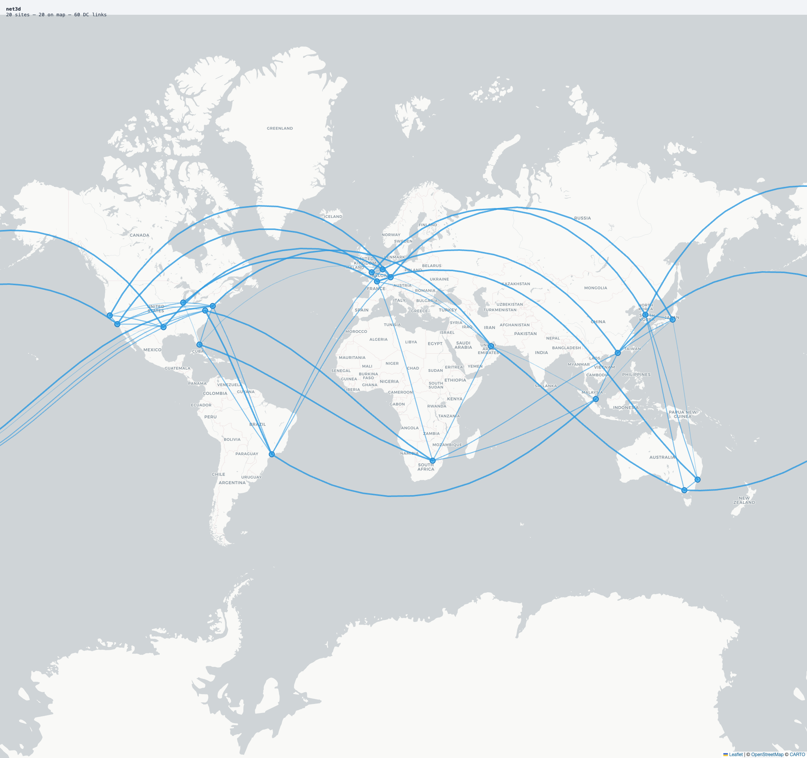
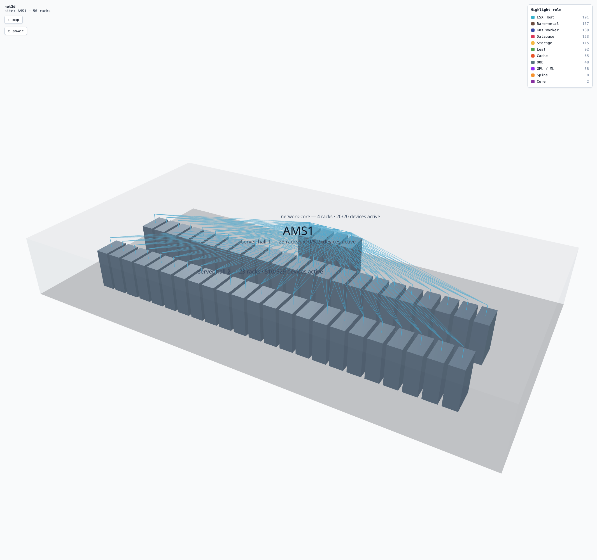
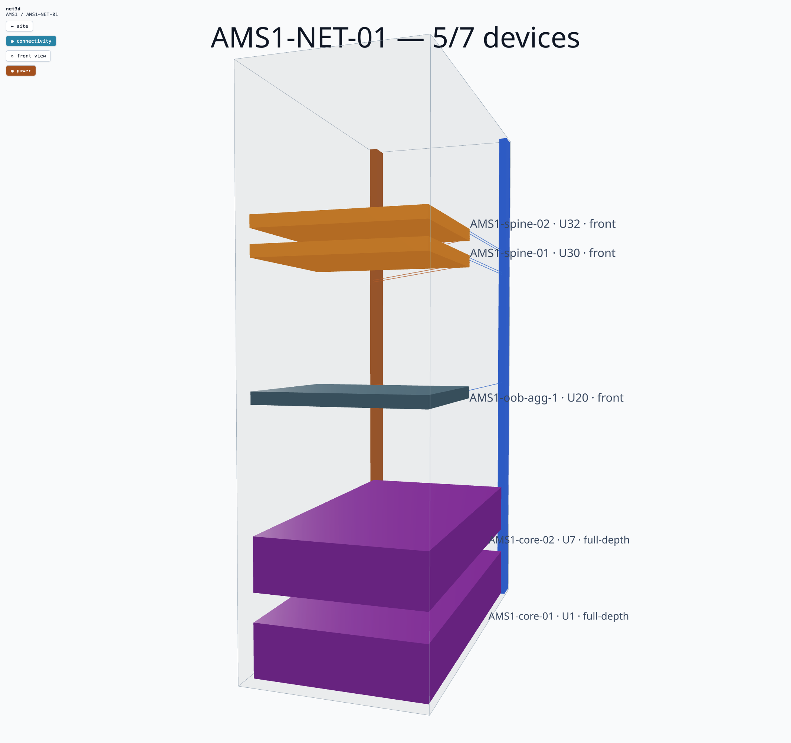

# net3d

**Zoom from the world map into a rack unit.** net3d turns your network source of truth —
[NetBox](https://netbox.dev) or [Infrahub](https://opsmill.com) — into an explorable
visualization: a real-tile world map of your sites, 3D buildings with your racks, devices
at their true U-positions, connected by one continuous mouse-wheel journey.

> ### 🌐 [Live demo → net3d.routingstate.com](https://net3d.routingstate.com)
> Explore it in your browser: the bundled showcase fabric, no setup required.

<p align="center">
  
  
  
</p>
<p align="center"><sub>World map → site building → rack, one continuous zoom (shown on the bundled <a href="showcase/">showcase</a> data).</sub></p>

## Features

- 🗺 **World map** (Leaflet + CARTO Positron) auto-fitted to your geocoded sites: clickable
  site markers colored by role (with a legend), and inter-DC circuits drawn as geodesic
  lines weighted by circuit capacity.
- 🔀 **Pluggable source of truth**: read from **NetBox or Infrahub** through one adapter
  seam (`SOT_BACKEND`); the visualization is identical either way. When both backends are
  deployed, an in-app switcher (with each backend's logo) flips between them at runtime —
  the [live demo](https://net3d.routingstate.com) serves both.
- 🔍 **Zoom-through navigation**: scroll into a site on the map and you crossfade into
  its 3D building; keep scrolling toward a rack and you're inside it; scroll out to
  retrace every step. Clicks work as shortcuts; hysteresis prevents level flapping.
- 🏢 **Procedural site view**: racks laid out in rows per NetBox location inside a
  glass building (NetBox stores no rack coordinates, so the floor plan is schematic).
- 📐 **Editable floor plan** (opt-in): drag and rotate racks, draw rooms and the floor
  outline to match your real datacenter; layouts are saved server-side per site and
  survive restarts. Off by default so a deployment stays a read-only viewer.
- 🗄 **Rack view**: devices at their real U-positions, sized by device-type height,
  colored by NetBox role color; documented cables routed down the side channel.
- 🔌 **Cabling, documented and discovered**: solid lines are NetBox cables (all
  termination types: interfaces, front/rear ports, console, power, circuits). Entering
  a site auto-discovers **LLDP neighbors via the NetBox NAPALM plugin** for every
  network-role device (switch/leaf/spine/router/firewall; the app never contacts
  devices directly), and entering a rack covers that rack's remaining devices. Links
  missing from NetBox render as dashed cyan cables — an undocumented fabric still
  shows up — and documented cables always win per link.
- 📟 **Live device panel**: NAPALM facts, environment sensors, interface up/down
  states (auto-refresh), live green/red cable coloring, and an LLDP-vs-NetBox audit.
- 🪶 **Graceful degradation**: without the NAPALM plugin, all live features hide and
  the app runs on documented data alone.
- 📊 **Specs heatmap**: color racks and devices by hardware density — CPU cores, RAM, or
  storage from device-type fields — aggregated per rack so dense compute stands out.
- ⚡ **Power-chain tracing**: follow a device's feed back through PDUs and power feeds to
  its source, with the whole chain highlighted in the rack.
- 🎨 **Role highlighting**: an interactive role legend in the site and rack views toggles
  emphasis per device role.
- 💾 **Disk-persistent cache**: the proxy's cache is keyed per backend instance and
  survives restarts, so a restart doesn't re-warm from cold.

## Requirements

- **Node.js ≥ 22** and [pnpm](https://pnpm.io) 11 (via `corepack enable`). Node 22 is
  required by pnpm 11; Node 20 will fail to install.
- A backend — **either**:
  - a **NetBox** instance, tested against **3.7.x and 4.x**, reachable over HTTP(S),
    with the **GraphQL API enabled** (NetBox's default) and a **read-only API token**; **or**
  - an **Infrahub** instance (set `SOT_BACKEND=infrahub`), reachable over HTTP(S) with an
    API token. NAPALM-backed live features are NetBox-only and hide automatically on Infrahub.
- Optional, for live data (NetBox only): [netbox-napalm-plugin](https://github.com/netbox-community/netbox-napalm-plugin)
  configured with platform → NAPALM driver mappings and device credentials.

No NetBox handy? Stand one up in minutes with
[netbox-docker](https://github.com/netbox-community/netbox-docker) and load the
[demo data](https://github.com/netbox-community/netbox-demo-data), or use the bundled
[`showcase/`](showcase/) stack.

## Quickstart (development)

```sh
cp .env.example .env     # set NETBOX_URL + NETBOX_TOKEN (NETBOX_TLS_VERIFY=false for internal CAs)
pnpm install
pnpm dev                 # API proxy on :3001, app on http://localhost:5173
pnpm test                # vitest across all packages
```

The API token never reaches the browser: a small Fastify proxy holds it, queries
NetBox GraphQL, normalizes the data, and caches responses.

### Try the demo (no NetBox needed)

**Zero setup:** a hosted instance of this showcase is live at
**[net3d.routingstate.com](https://net3d.routingstate.com)**.

To run it locally instead, the bundled [`showcase/`](showcase/) stack stands up a local
NetBox 4.x seeded with a fictional 20-site fabric. **Requires Docker (Compose v2) and
Python 3.** Full details in [`showcase/README.md`](showcase/README.md); the short path:

```sh
cd showcase && ./setup.sh        # clones netbox-docker, boots local NetBox on :8088 (~2–4 min first run)
# then create the demo API token: copy the command from showcase/README.md ("API token")
cd seed && python3 -m venv .venv && ./.venv/bin/pip install -r requirements.txt
./.venv/bin/python seed.py        # seeds the fabric (~10–20 min)
cd ../.. && pnpm install && pnpm dev:showcase   # app on http://localhost:5173
```

## Connecting your NetBox

1. **Mint a token.** In NetBox, open your profile → **API Tokens** → **Add a token**.
   A read-only token is enough; you can untick *Write enabled*. Copy the key into
   `NETBOX_TOKEN` and set `NETBOX_URL` to the instance base URL (e.g.
   `https://netbox.example.com`, no trailing `/api`).
2. **Start the server.** On boot it verifies the connection and prints one of:
   - `✓ Connected to NetBox 4.0.5 at https://netbox.example.com, NAPALM available`
   - `✗ Cannot reach NetBox …` followed by a specific hint, then exits. The hint
     distinguishes a bad token, an unresolvable host, a refused connection, an
     untrusted TLS certificate, and a disabled GraphQL API.

   (Set `SKIP_NETBOX_CHECK=1` — or the backend-agnostic `SKIP_SOT_CHECK=1` — to boot
   without the preflight, e.g. when the backend isn't up yet.)

### Using Infrahub instead

net3d reads from [Infrahub](https://opsmill.com) through the same adapter; switch backends
with a few env vars (no code change):

```sh
SOT_BACKEND=infrahub
INFRAHUB_URL=https://infrahub.example.com   # base URL, no trailing /graphql
INFRAHUB_TOKEN=…                             # Infrahub API token
INFRAHUB_BRANCH=main                         # optional, defaults to "main"
```

The server's boot preflight then reports the Infrahub connection instead of NetBox.
NAPALM/LLDP live features stay hidden (they have no Infrahub equivalent); everything else —
map, sites, racks, cabling, specs heatmap, power chains — works identically. A local
Infrahub demo stack lives in [`showcase/infrahub/`](showcase/infrahub/); run it with
`pnpm dev:showcase-infrahub`.

## Running in production / self-hosting

Two supported ways to run net3d against your own NetBox. Both serve the built UI and
the API from a single Fastify process.

### Docker (one command)

```sh
cp .env.example .env          # set NETBOX_URL + NETBOX_TOKEN
docker compose up --build     # then open http://localhost:8080
```

- Change the published port with `NET3D_PORT` (e.g. `NET3D_PORT=9000 docker compose up`).
- Pre-warm caches for snappier first loads with `PREWARM=1` in `.env`.
- If NetBox runs on your **host** (e.g. the showcase on `localhost:8088`), point the
  container at it via `NETBOX_URL=http://host.docker.internal:8088`.

### Manual (Node)

```sh
pnpm install
pnpm build                                   # → packages/web/dist
WEB_DIST="$PWD/packages/web/dist" \
  NETBOX_URL=https://netbox.example.com \
  NETBOX_TOKEN=… HOST=0.0.0.0 PORT=8080 \
  pnpm start                                 # serves UI + API on :8080
```

`pnpm start` runs the Fastify server; with `WEB_DIST` set it also serves the built UI.
Put it behind your own TLS / reverse proxy.

### Floor-plan editing (optional)

The schematic layout can be edited in-app and saved per site:

```sh
LAYOUT_EDIT=1                  # show the "Edit layout" toolbar and allow saving
LAYOUT_DIR=/var/lib/net3d/layouts   # storage dir (default: packages/server/.data/net3d-layouts)
```

Layouts are one JSON file per site — in a container, point `LAYOUT_DIR` at a mounted
volume so they survive redeploys. `LAYOUT_PREVIEW=1` applies saved layouts and shows the
editor without allowing writes (nice for public demos). See `.env.example` for details.

### Security

net3d is a **read-only** visualizer and its API is **unauthenticated by default**. It
binds to `127.0.0.1` and is meant to sit **behind a TLS reverse proxy that handles
authentication** in production. Exposed without one, anyone who can reach it can read
all NetBox data the server fetches (devices, IPs, topology, power, live NAPALM).

- Set `HOST=0.0.0.0` only when a proxy is in front of it.
- Optional `NET3D_API_TOKEN`: when set, every `/api/*` route (except `/api/health`)
  requires `Authorization: Bearer <token>`. A browser can't hold a secret, so use it
  for API clients or have the proxy inject the header after authenticating the user;
  leave it unset for the open read-only demo.
- `NETBOX_TLS_VERIFY=false` relaxes certificate checks **only** for NetBox calls.

See [SECURITY.md](SECURITY.md) for the full model and how to report vulnerabilities.

## Optional enrichments

net3d runs on core NetBox data alone. These unlock extra detail when present, and are
silently ignored when not:

- **Device-type custom fields** `cpu_model` (text), `cpu_cores` (integer), `ram_gb`
  (integer), `storage_tb` (integer) → a hardware-specs section in the device panel and
  the per-rack **specs heatmap**.
- **Site tags** `compute` or `pop` → a role badge and marker color on the map.
- **netbox-napalm-plugin** → live facts/environment/interfaces and LLDP cabling
  discovery. Without it those features simply hide.

## Architecture

```
packages/
├── shared/   pure, fully-tested logic: map bounds & geodesics, rack layout,
│             device U-transforms, cable paths, zoom-navigation state machine,
│             LLDP↔cable diffing
├── server/   Fastify proxy: a pluggable source-of-truth seam (sot/ → NetBox or
│             Infrahub client behind one SoTClient interface), connection preflight,
│             GraphQL queries, polymorphic cable-termination normalization, TTL +
│             disk-persistent caches, NAPALM method allowlist + load shedding,
│             optional static UI hosting
└── web/      Vite + React 19 + react-leaflet 5 + react-three-fiber 9 + zustand
```

### Good to know

- **NetBox 3.7 ↔ 4.x differences are handled automatically**: the server detects the
  version at runtime and switches GraphQL dialect (filter syntax, enum casing,
  pagination, polymorphic terminations).
- **NAPALM calls are live SSH sessions** opened by NetBox (~25 s per device on real
  hardware). net3d bounds concurrency (3 client-side, 8 server-side with 429 shedding)
  and caches LLDP answers for 60 minutes; site-wide discovery is progressive, not
  blocking, and devices NAPALM can't reach are skipped silently.
- **LLDP hostnames are matched to SoT device names** by stripping the domain and,
  when needed, a site/pod prefix (`par1-cp01-lf1001.example.net` matches device
  `lf1001`), so discovered links resolve even when naming conventions differ.
- Sites without latitude/longitude don't appear on the map but stay reachable through
  the search box.

## Troubleshooting

| Symptom | Likely cause & fix |
|---------|--------------------|
| Server exits at boot with `✗ …` | Follow the printed hint (token, URL, TLS, or GraphQL). |
| Map loads, then a red `⚠ Can't reach NetBox` | The proxy reached NetBox but a query failed; check the server logs. |
| `✗ … TLS certificate is not trusted` | Internal/self-signed CA: set `NETBOX_TLS_VERIFY=false`. |
| `✗ … GraphQL returned HTTP 4xx` | Enable the GraphQL API in NetBox (it is on by default). |
| `pnpm install` fails with `node:sqlite` | You're on Node < 22; pnpm 11 needs Node 22+. |
| Site view is empty or sparse | NetBox has no rack positions/faces there; devices without a U-position aren't drawn. |
| No live device data / no LLDP links | The NAPALM plugin isn't installed (optional). |
| A site is missing from the map | It has no latitude/longitude; reach it via the search box. |

## License

[MIT](LICENSE)
