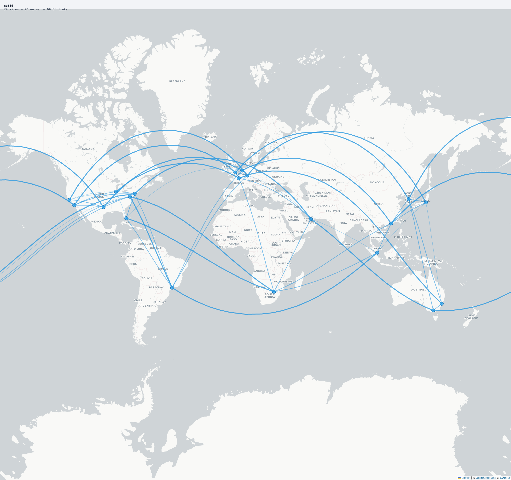
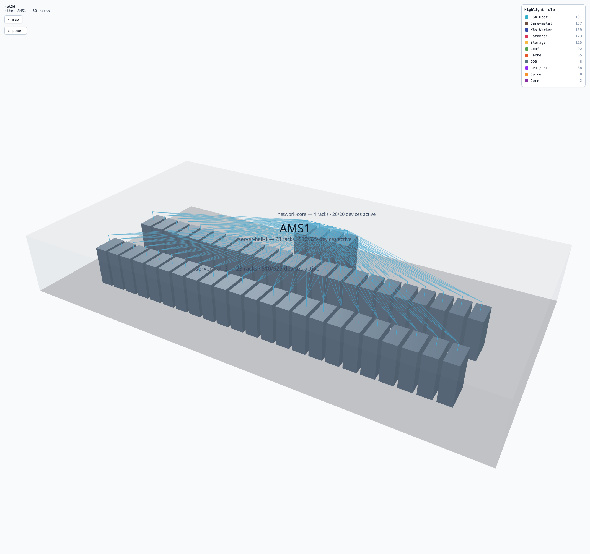
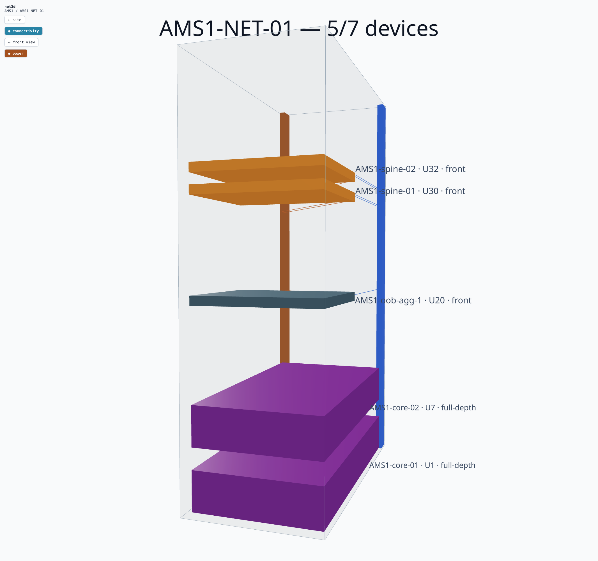

# net3d

**Zoom from the world map into a rack unit.** net3d turns your network source of truth —
[NetBox](https://netbox.dev) or [Infrahub](https://opsmill.com) — into an explorable
visualization: a real-tile world map of your sites, 3D buildings with your racks, devices
at their true U-positions, connected by one continuous mouse-wheel journey.

> ### 🌐 [Live demo → net3d.routingstate.com](https://net3d.routingstate.com)
> Explore it in your browser: the bundled showcase fabric, no setup required.

<p align="center">
  
  
  
</p>
<p align="center"><sub>World map → site building → rack, one continuous zoom (shown on the bundled <a href="showcase/">showcase</a> data).</sub></p>

## Features

- 🗺 **World map** (Leaflet + CARTO Positron) auto-fitted to your geocoded sites: clickable
  site markers colored by role (with a legend), and inter-DC circuits drawn as geodesic
  lines weighted by circuit capacity.
- 🔀 **Pluggable source of truth**: read from **NetBox or Infrahub** through one adapter
  seam (`SOT_BACKEND`); the visualization is identical either way. When both backends are
  deployed, an in-app switcher (with each backend's logo) flips between them at runtime —
  the [live demo](https://net3d.routingstate.com) serves both.
- 🔍 **Zoom-through navigation**: scroll into a site on the map and you crossfade into
  its 3D building; keep scrolling toward a rack and you're inside it; scroll out to
  retrace every step. Clicks work as shortcuts; hysteresis prevents level flapping.
- ⌨️ **Keyboard search**: find sites and devices with Arrow keys, Enter, and Escape.
  Device search shows how much of your inventory has been indexed, keeps partial
  results available, and updates as more sites warm in the background.
- 🪶 **Load 3D only when needed**: the initial map starts without a WebGL context;
  hovering a site preloads the scene for entry. Initial JavaScript is about 66%
  smaller than before this change (154 kB versus 454 kB gzip).
- 🏢 **Procedural site view**: racks laid out in rows per NetBox location inside a
  glass building (NetBox stores no rack coordinates, so the floor plan is schematic).
- 📐 **Editable floor plan** (opt-in): drag and rotate racks, draw rooms and the floor
  outline to match your real datacenter; layouts are saved server-side per site and
  survive restarts. Off by default so a deployment stays a read-only viewer.
- 🗄 **Rack view**: devices at their real U-positions, sized by device-type height,
  colored by NetBox role color; documented cables routed down the side channel.
- 🔌 **Cabling, documented and discovered**: solid lines are NetBox cables (all
  termination types: interfaces, front/rear ports, console, power, circuits). Entering
  a site auto-discovers **LLDP neighbors via the NetBox NAPALM plugin** for every
  network-role device (switch/leaf/spine/router/firewall; the app never contacts
  devices directly), and entering a rack covers that rack's remaining devices. Links
  missing from NetBox render as dashed cyan cables — an undocumented fabric still
  shows up — and documented cables always win per link. Discovery reports successful,
  failed, and pending devices; **Retry failed** repeats only unsuccessful requests.
- 🔎 **Cable trace through patch panels** (NetBox): click any connected port — on a
  switch, a server, or a patch panel itself — and the full end-to-end path lights up
  in 3D, following NetBox's front↔rear port pass-throughs across racks. The device
  panel draws the route hop by hop (panels included), with keyboard-accessible
  buttons to follow the cable rack to rack, and the traced run glows on the overhead
  tray in the site view. Infrahub has no patch-panel model, so that backend states the gap
  explicitly — the contrast is part of the demo.
- 📟 **Live device panel**: NAPALM facts, environment sensors, interface up/down
  states (auto-refresh), live green/red cable coloring, and an LLDP-vs-NetBox audit.
- 🪶 **Graceful degradation**: without the NAPALM plugin, all live features hide and
  the app runs on documented data alone.
- 📊 **Specs heatmap**: color racks and devices by hardware density — CPU cores, RAM, or
  storage from device-type fields — aggregated per rack so dense compute stands out.
- ⚡ **Power-chain tracing**: follow a device's feed back through PDUs and power feeds to
  its source, with the whole chain highlighted in the rack.
- 🎨 **Role highlighting**: an interactive role legend in the site and rack views toggles
  emphasis per device role.
- 💾 **Disk-persistent cache**: the proxy's cache is keyed per backend instance and
  Infrahub branch and survives restarts, so a restart doesn't re-warm from cold.
  Concurrent loads share one upstream request; invalidation prevents older requests
  from replacing newer data.
- 🔄 **Recoverable site loading**: failed loads offer **Retry**, empty sites are
  identified explicitly, and background refresh failures keep existing topology
  visible with a stale-data notice.
- ⚡ **Live updates** (opt-in): point a NetBox or Infrahub webhook at net3d and edits in
  your source of truth appear in the 3D view within a second or two — the server busts
  its cache and pushes an invalidation to every open browser over SSE. Connection
  status is visible, reconnecting catches up on missed changes, and a 60-second
  visible-tab refresh provides a fallback when SSE is unavailable or disconnected.
- 📡 **Live telemetry** (opt-in): point net3d at a telemetry collector that speaks a
  small [two-endpoint contract](docs/telemetry.md) to show real-time link rx/tx and
  utilisation on cables, map circuit arcs and room DC links, and per-port rates in the
  device panel — see "Live telemetry" below.

## Requirements

- **Node.js ≥ 22** and [pnpm](https://pnpm.io) 11 (via `corepack enable`). Node 22 is
  required by pnpm 11; Node 20 will fail to install.
- A backend — **either**:
  - a **NetBox** instance, tested against **3.7.x and 4.x**, reachable over HTTP(S),
    with the **GraphQL API enabled** (NetBox's default) and a **read-only API token**; **or**
  - an **Infrahub** instance (set `SOT_BACKEND=infrahub`), reachable over HTTP(S) with an
    API token. NAPALM-backed live features are NetBox-only and hide automatically on Infrahub.
- Optional, for live data (NetBox only): [netbox-napalm-plugin](https://github.com/netbox-community/netbox-napalm-plugin)
  configured with platform → NAPALM driver mappings and device credentials.

No NetBox handy? Stand one up in minutes with
[netbox-docker](https://github.com/netbox-community/netbox-docker) and load the
[demo data](https://github.com/netbox-community/netbox-demo-data), or use the bundled
[`showcase/`](showcase/) stack.

## Quickstart (development)

```sh
cp .env.example .env     # set NETBOX_URL + NETBOX_TOKEN (NETBOX_TLS_VERIFY=false for internal CAs)
pnpm install
pnpm dev                 # API proxy on :3001, app on http://localhost:5173
pnpm test                # vitest across all packages
pnpm test:coverage       # full source report; 80% gate on TypeScript logic
```

CI runs coverage, typechecking, and the production build. Cache coordination and
the shared LLDP queue enforce 100% coverage; the full report also includes TSX
components, which are outside the 80% core-logic gate.

The API token never reaches the browser: a small Fastify proxy holds it, queries
NetBox GraphQL, normalizes the data, and caches responses.

### Try the demo (no NetBox needed)

**Zero setup:** a hosted instance of this showcase is live at
**[net3d.routingstate.com](https://net3d.routingstate.com)**.

To run it locally instead, the bundled [`showcase/`](showcase/) stack stands up a local
NetBox 4.x seeded with a fictional 20-site fabric. **Requires Docker (Compose v2) and
Python 3.** Full details in [`showcase/README.md`](showcase/README.md); the short path:

```sh
cd showcase && ./setup.sh        # clones netbox-docker, boots local NetBox on :8088 (~2–4 min first run)
# then create the demo API token: copy the command from showcase/README.md ("API token")
cd seed && python3 -m venv .venv && ./.venv/bin/pip install -r requirements.txt
./.venv/bin/python seed.py        # seeds the fabric (~10–20 min)
cd ../.. && pnpm install && pnpm dev:showcase   # app on http://localhost:5173
```

Run `pnpm dev:showcase-live` instead of `pnpm dev:showcase` to also see the optional live
telemetry views, fed by a bundled traffic simulator instead of real routers (see
[`showcase/README.md`](showcase/README.md#5-live-telemetry-optional)).

## Connecting your NetBox

1. **Mint a token.** In NetBox, open your profile → **API Tokens** → **Add a token**.
   A read-only token is enough; you can untick *Write enabled*. Copy the key into
   `NETBOX_TOKEN` and set `NETBOX_URL` to the instance base URL (e.g.
   `https://netbox.example.com`, no trailing `/api`).
2. **Start the server.** On boot it verifies the connection and prints one of:
   - `✓ Connected to NetBox 4.0.5 at https://netbox.example.com, NAPALM available`
   - `✗ Cannot reach NetBox …` followed by a specific hint, then exits. The hint
     distinguishes a bad token, an unresolvable host, a refused connection, an
     untrusted TLS certificate, and a disabled GraphQL API.

   (Set `SKIP_NETBOX_CHECK=1` — or the backend-agnostic `SKIP_SOT_CHECK=1` — to boot
   without the preflight, e.g. when the backend isn't up yet.)

### Using Infrahub instead

net3d reads from [Infrahub](https://opsmill.com) through the same adapter; switch backends
with a few env vars (no code change):

```sh
SOT_BACKEND=infrahub
INFRAHUB_URL=https://infrahub.example.com   # base URL, no trailing /graphql
INFRAHUB_TOKEN=…                             # Infrahub API token
INFRAHUB_BRANCH=main                         # optional, defaults to "main"
```

The server's boot preflight then reports the Infrahub connection instead of NetBox.
NAPALM/LLDP live features stay hidden (they have no Infrahub equivalent), and the
patch-panel cable trace shows a "not available on this backend" note (Infrahub has no
front/rear-port model); everything else — map, sites, racks, cabling, specs heatmap,
power chains — works identically. A local
Infrahub demo stack lives in [`showcase/infrahub/`](showcase/infrahub/); run it with
`pnpm dev:showcase-infrahub`.

## Running in production / self-hosting

Two supported ways to run net3d against your own NetBox. Both serve the built UI and
the API from a single Fastify process.

### Docker (one command)

```sh
cp .env.example .env          # set NETBOX_URL + NETBOX_TOKEN
docker compose up --build     # then open http://localhost:8080
```

- Change the published port with `NET3D_PORT` (e.g. `NET3D_PORT=9000 docker compose up`).
- Pre-warm caches for snappier first loads with `PREWARM=1` in `.env`.
- Topology requests time out after 120 seconds by default. Override this for either
  backend with a positive integer `TOPOLOGY_TIMEOUT_MS` value in milliseconds.
- World-map tiles: CARTO requires a (free) API key for its basemaps — without one the
  map shows an "API KEY REQUIRED" watermark. Get a key at
  [carto.com/basemaps/apikey](https://carto.com/basemaps/apikey) and set
  `VITE_CARTO_KEY` in `.env` before building. It's baked into the UI bundle at build
  time (client-side by design, not a secret) and works for `pnpm dev` too.
- If NetBox runs on your **host** (e.g. the showcase on `localhost:8088`), point the
  container at it via `NETBOX_URL=http://host.docker.internal:8088`.

### Manual (Node)

```sh
pnpm install
pnpm build                                   # → packages/web/dist
WEB_DIST="$PWD/packages/web/dist" \
  NETBOX_URL=https://netbox.example.com \
  NETBOX_TOKEN=… HOST=0.0.0.0 PORT=8080 \
  pnpm start                                 # serves UI + API on :8080
```

`pnpm start` runs the Fastify server; with `WEB_DIST` set it also serves the built UI.
Put it behind your own TLS / reverse proxy.

### Floor-plan editing (optional)

The schematic layout can be edited in-app and saved per site:

```sh
LAYOUT_EDIT=1                  # show the "Edit layout" toolbar and allow saving
LAYOUT_DIR=/var/lib/net3d/layouts   # storage dir (default: packages/server/.data/net3d-layouts)
```

Layouts are one JSON file per site — in a container, point `LAYOUT_DIR` at a mounted
volume so they survive redeploys. `LAYOUT_PREVIEW=1` applies saved layouts and shows the
editor without allowing writes (nice for public demos). See `.env.example` for details.

### Live updates (optional)

Without SSE, the browser refreshes active topology queries every 60 seconds while
the tab is visible; upstream cache TTLs still apply. To reflect SoT changes in
near-real-time, set a shared secret and register a webhook:

```sh
WEBHOOK_SECRET=<random string>   # enables POST /api/webhooks/{netbox,infrahub} + GET /api/events
```

Then point your backend at the receiver (net3d verifies the HMAC signature on every
delivery, so the endpoint is safe to expose alongside the API):

- **NetBox 4.x**: create a *Webhook* (URL `https://<net3d-host>/api/webhooks/netbox`,
  secret = `WEBHOOK_SECRET`) plus *Event Rules* for create/update/delete on sites,
  devices, racks, cables, power panels and power feeds — or run the idempotent
  [`showcase/seed/register_webhooks.py`](showcase/seed/register_webhooks.py) against
  your instance (`NETBOX_URL`/`NETBOX_TOKEN`/`WEBHOOK_SECRET`/`WEBHOOK_CALLBACK` env vars).
- **NetBox 3.7**: a single *Webhook* object carries the content types and events; same
  URL and secret.
- **Infrahub**: standard webhooks, one per event type × node kind — run
  [`showcase/infrahub/register_webhooks.py`](showcase/infrahub/register_webhooks.py).

The browser subscribes to `GET /api/events` (SSE) and refetches exactly what changed:
NetBox events invalidate per site, Infrahub events invalidate everything (its payloads
carry no site linkage). Broadcasts are debounced ~1 s so bulk imports coalesce instead
of stampeding clients. The status indicator shows `live`, `reconnecting`, or
`polling`. Reconnection refreshes affected caches to recover missed events. When
`WEBHOOK_SECRET` is unset, the webhook/SSE routes are disabled and the browser uses
the visible-tab refresh fallback instead.

### Live telemetry (optional)

Set `NETSTATEX_URL` (and optional `NETSTATEX_TOKEN`) to color cables by live gNMI %
utilisation in the rack and site views, and show live rx/tx rates per port in the
device panel; a port goes grey only when its telemetry is stale. The data comes from a
telemetry collector that the **server** polls — netstatex (a gNMI collector) or any
collector implementing the two-endpoint contract in [docs/telemetry.md](docs/telemetry.md).
The browser never talks to it, and device addresses/raw counters are never exposed in
API responses. Keying is by exact match on the device and interface names in your
source of truth (NetBox or Infrahub), so the collector must use the same names. The
browser polls `GET /api/telemetry/sites/:site` every 2 s only while the 'live' cable
colouring is on or a device panel is open. `GET /api/meta` reports
`telemetryAvailable: true` only when `NETSTATEX_URL` is set to a non-blank value;
otherwise the telemetry routes don't exist and nothing polls.

**With Docker Compose**, run the collector as a service of the same Compose project
with no published port — e.g. in a `docker-compose.override.yml` next to
`docker-compose.yml`, which `docker compose up` merges automatically. That file and
`collector.yaml` are git-ignored and never copied into the net3d image:

```yaml
services:
  collector:
    image: your-collector-image   # any collector speaking docs/telemetry.md
    # Listen on 0.0.0.0:8090 inside the container. No `ports:` on purpose:
    # only net3d, on the same Compose network, can reach it.
    volumes:
      - ./collector.yaml:/etc/collector.yaml:ro   # devices + credentials: mounted, not baked in
    restart: unless-stopped
```

Then in `.env` — the service name, not `127.0.0.1` (inside the net3d container that is
net3d itself):

```sh
NETSTATEX_URL=http://collector:8090
# Only if the collector requires a bearer token:
# NETSTATEX_TOKEN=
```

For the manual Node run, a collector on the same host is `http://127.0.0.1:8090`.

**Map and room views**: the Leaflet map shows inter-site circuits as arcs whose colour
reflects the busiest member circuit (by % utilisation). Each live arc displays an
always-on Gbps label (busiest arcs labelled first, labels repositioned on zoom/pan).
Hovering an arc shows per-circuit rates and a live total. In the room view, DC links
radiating toward peer sites show live utilisation the same way when the Layers panel
has "DC links" visible and cable colouring set to "live". All live views share a
logarithmic colour scale (0.01 · 0.1 · 1 · 10 · 100 %) so low-utilisation links remain
visually distinct. The map polls `GET /api/telemetry/circuits` every 5 s while visible
(foreground only). Circuits go live when their terminations are cabled directly to
router interfaces — see
[docs/telemetry.md](docs/telemetry.md#how-rates-are-matched-to-cables).

### Security

net3d is a **read-only** visualizer and its API is **unauthenticated by default**. It
binds to `127.0.0.1` and is meant to sit **behind a TLS reverse proxy that handles
authentication** in production. Exposed without one, anyone who can reach it can read
all NetBox data the server fetches (devices, IPs, topology, power, live NAPALM).

- Set `HOST=0.0.0.0` only when a proxy is in front of it.
- Optional `NET3D_API_TOKEN`: when set, every `/api/*` route (except `/api/health`)
  requires `Authorization: Bearer <token>`. A browser can't hold a secret, so use it
  for API clients or have the proxy inject the header after authenticating the user;
  leave it unset for the open read-only demo. Webhook routes are exempt (they carry
  their own HMAC auth), as is the `/api/events` stream (EventSource can't send
  headers; it only ever emits "something at site X changed" pings).
- `NETBOX_TLS_VERIFY=false` relaxes certificate checks **only** for NetBox calls.

See [SECURITY.md](SECURITY.md) for the full model and how to report vulnerabilities.

## Optional enrichments

net3d runs on core NetBox data alone. These unlock extra detail when present, and are
silently ignored when not:

- **Device-type custom fields** `cpu_model` (text), `cpu_cores` (integer), `ram_gb`
  (integer), `storage_tb` (integer) → a hardware-specs section in the device panel and
  the per-rack **specs heatmap**.
- **Site tags** `compute` or `pop` → a role badge and marker color on the map.
- **netbox-napalm-plugin** → live facts/environment/interfaces and LLDP cabling
  discovery. Without it those features simply hide.

## Architecture

```
packages/
├── shared/   pure, fully-tested logic: map bounds & geodesics, rack layout,
│             device U-transforms, cable paths, zoom-navigation state machine,
│             LLDP↔cable diffing
├── server/   Fastify proxy: a pluggable source-of-truth seam (sot/ → NetBox or
│             Infrahub client behind one SoTClient interface), connection preflight,
│             GraphQL queries, polymorphic cable-termination normalization, TTL +
│             disk-persistent caches, NAPALM method allowlist + load shedding,
│             optional static UI hosting
└── web/      Vite + React 19 + react-leaflet 5 + react-three-fiber 9 + zustand
```

### Good to know

- **NetBox 3.7 ↔ 4.x differences are handled automatically**: the server detects the
  version at runtime and switches GraphQL dialect (filter syntax, enum casing,
  pagination, polymorphic terminations).
- **NAPALM calls are live SSH sessions** opened by NetBox (~25 s per device on real
  hardware). net3d bounds concurrency (3 client-side, 8 server-side with 429 shedding)
  and caches LLDP answers for 60 minutes; site-wide discovery is progressive, not
  blocking. Unreachable devices count as failed discovery and can be retried.
  Leaving a site cancels queued browser requests; this does not guarantee that an
  SSH operation already started by NetBox is cancelled.
- **Device search indexes loaded sites**, rather than querying every device on each
  keystroke. With `PREWARM=1`, incomplete results refresh every 15 seconds while the
  tab is visible. Without prewarming, coverage stays partial until more sites are
  loaded; switching backends resets the displayed index coverage.
- **LLDP hostnames are matched to SoT device names** by stripping the domain and,
  when needed, a site/pod prefix (`site1-pod1-lf901.example.net` matches device
  `lf901`), so discovered links resolve even when naming conventions differ.
- Sites without latitude/longitude don't appear on the map but stay reachable through
  the search box.

## Troubleshooting

| Symptom | Likely cause & fix |
|---------|--------------------|
| Server exits at boot with `✗ …` | Follow the printed hint (token, URL, TLS, or GraphQL). |
| Map loads, then a red `⚠ Can't reach NetBox` | The proxy reached NetBox but a query failed; check the server logs. |
| `✗ … TLS certificate is not trusted` | Internal/self-signed CA: set `NETBOX_TLS_VERIFY=false`. |
| `✗ … GraphQL returned HTTP 4xx` | Enable the GraphQL API in NetBox (it is on by default). |
| `pnpm install` fails with `node:sqlite` | You're on Node < 22; pnpm 11 needs Node 22+. |
| Site view is empty or sparse | NetBox has no rack positions/faces there; devices without a U-position aren't drawn. |
| No live device data / no LLDP links | The NAPALM plugin isn't installed (optional). |
| A site is missing from the map | It has no latitude/longitude; reach it via the search box. |
| Map tiles say `API KEY REQUIRED` | Set `VITE_CARTO_KEY` in `.env` (free key: [carto.com/basemaps/apikey](https://carto.com/basemaps/apikey)) and rebuild/restart; force-refresh, tiles are cached. |
| Site loading fails | Use **Retry**; check the proxy/backend connection if the error persists. A failed background refresh keeps the last available topology visible. |
| Device search misses inventory | Check indexed-site coverage; enable `PREWARM=1` or visit the missing site's detail view. |
| LLDP discovery is incomplete | Check the failed-device count and use **Retry failed**; verify NAPALM reachability for those devices. |
| NetBox edits take minutes to appear | The 60-second browser fallback still observes upstream cache TTLs; set `WEBHOOK_SECRET` and register a webhook for prompt invalidation (see *Live updates*). |

## License

[MIT](LICENSE)
